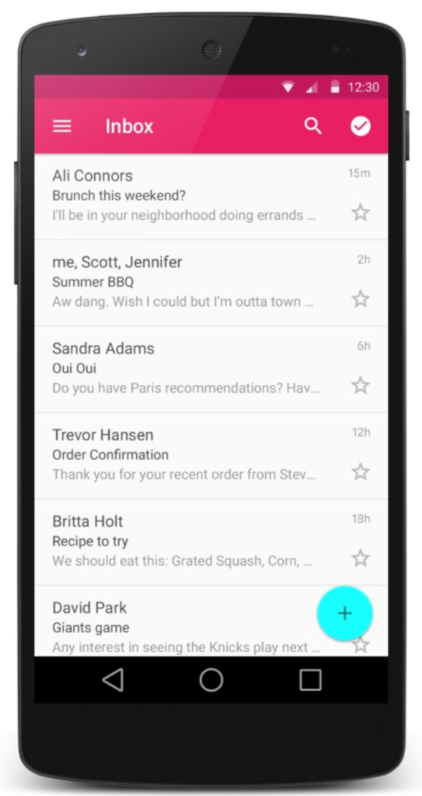

# Lists

{:.inline style="width:30%"}

Almost every app will use `ListView`s to present information. Sometimes it's search results, sometimes it's just a simple choice of options for the user to choose from.

## Static lists

In some cases, all that's needed is a list that always presents the same information. For example, if a user is to select their preferred phone OS, the list of choices may not change very frequently, and you might add the list to a **string resource file**:

    <!-- res/values/strings.xml -->
    <resources>
    <string-array name="oses">
            <item>Android</item>
            <item>iPhone</item>
            ...
            <item>Max OS X</item>
        </string-array>
    </resources>

In your layout, you can then set the `entries` property of the list, which automatically loads the options from the string resource:

    <!-- res/layout/activity_main.xml -->
    <ListView ... android:id="@+id/mylist"
        android:entries="@array/oses" />

## Dynamic lists

More often, the information in a list should be loaded dynamically, for example when presenting search results, or when data needs to be loaded from a web server. To do that, we will use the list view in conjuction with an `Adapter`.

Upon request, the `Adapter` will provide the list with **views for each row**. If a list is loaded and on the screen, and the user slowly scrolls upward, a new row becomes visible. Just before showing it, the list view asks the `Adapter` to provide a `View` containing information for a single row in the list. At the other end of the list, rows disappear on the edge of the screen. The views for these rows are automatically handed back to the adapter to re-use. That way, it is possible to show a very long list using a limited number of `View` objects.

## Array adapters

There are a couple of simple adapters that you might use, where you don't even have to write code to load the data. Instead, you provide the adapter with a reference to some data structure, and the adapter manages requesting entries from that structure by itself. One example is the `ArrayAdapter`, which only needs a reference to an array to work correctly:

    ArrayAdapter<String> name =
        new ArrayAdapter<String>(activity, layout, array);

- the activity is usually `this`
- the default layout for lists is `android.R.layout.simple_list_item_1`
- the array might for example be `String[]`, or a list like `ArrayList<String>`

Once you have an adapter, you can attach it to your list by calling the `setAdapter` method of the `ListView` object in the Java code. A full example:

    ArrayList<String> myArray = ...;  // load data from file
    ArrayAdapter<String> adapter =
        new ArrayAdapter<String>(
            this,
            android.R.layout.simple_list_item_1,
            myArray);
    ListView list = (ListView) findViewById(R.id.mylist);
    list.setAdapter(myAdapter);

## List events

Unfortunately, list views do no support the simple `onClick` event, like buttons do. To catch events, you will need to create a listener class that `implements AdapterView.OnItemClickListener` and responds to one or more of the following events:

- Listener for when an item in the list has been clicked: `setOnItemClickListener(AdapterView.OnItemClickListener)`

- Listener for when an item in the list has been clicked and held: setOnItemLongClickListener(AdapterView.OnItemLongClickListener)

- Listener for when an item in the list has been selected: setOnItemSelectedListener(AdapterView.OnItemSelectedListener)

## Custom list layouts

If you want your list to look different than the default appearance (just a text string for each line), you must:

- write a short layout XML file describing the layout for each row
- write a subclass of `ArrayAdapter` that overrides the `getView` method to describe what view must be returned for each row

Example of a layout:

    <!-- res/layout/mylistlayout.xml -->
    <?xml version="1.0" encoding="utf-8"?>
    <LinearLayout ... android:orientation="horizontal">
         <ImageView ... android:id="@+id/list_row_image"
             android:layout_width="100dp"
             android:layout_height="100dp"
             android:src="@drawable/smiley" />
         <TextView ... android:id="@+id/list_row_text"
             android:textStyle="bold"
             android:textSize="22dp"
             android:text=""
             android:background="#336699" />
    </LinearLayout>

An an example of a custom Adapter class:

    // MyAdapter.java (separate Java class)
    public class MyAdapter extends ArrayAdapter<String> {
        private int layoutResourceId;
        private List<String> data;

        public MyAdapter(Context context, int layoutId, List<String> list) {
            super(context, layoutResourceId, data);
            layoutResourceId = layoutId;
            data = list;
        }

        @Override
        public View getView(int index, View row, ViewGroup parent) {
            row = getLayoutInflater().inflate(layoutResourceId, parent, false);
            TextView text = (TextView) row.findViewById(R.id.list_row_text);
            text.setText(data.get(index));
            return row;
        }
    }

## References

- [ListViews](https://www.youtube.com/watch?v=rhj4_KBD6BQ&list=PLGLfVvz_LVvSPjWpLPFEfOCbezi6vATIh&index=5) video by Derek Banas.

<!--
Unsure about where to get started with this week's assignment? Here's a [tutorial](http://www.journaldev.com/9247/android-listview-example-tutorial) that provides a simple basis for your app's ListView.

Other (optional) tutorials on ListViews can be found here:

* [ListView Tutorial](http://www.vogella.com/tutorials/AndroidListView/article.html)

* [ListView and Styling](https://www.raywenderlich.com/124438/android-listview-tutorial)
-->

