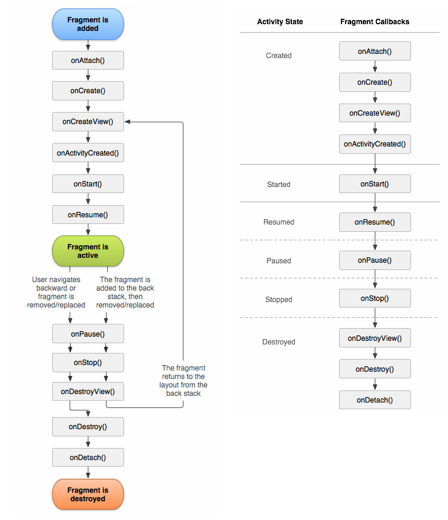

# Fragments

## What are Fragments?
Fragments are widely used in Android Applications. A `Fragment` is a subpart of an `Activity`. You can think of them as a sort of sub-activities. It usually represents a portion of the user interface, with the associated behaviour. This allows for flexible UI design, as an activity can contain multiple fragments, all with their own lifecycle and input events. You can add and remove fragments while the activity is running. In this guide we will explain the basics of fragments and their use.

## What is a Fragment made of?
Fragments have their own layout, so they use their own layout xml as well. This xml is stored under `res/layout`, just like the regular layout files for your activities.

They also have their own Java file which extends the `Fragment` class, which contains the fragment's fuctionality. This is similar to your activities, which are contained in a Java file with a class that usually extends `AppCompatActivity`.

A fragment can't exist on its own though, a fragment does need a parent activity to run. This is the activity to which a fragment is **attached**. In this parent activity, a layout is defined in which the fragment will be shown. Then, in the parent activities code, the fragment is programatically attached to this activity. The parent activity can also share data with the fragment and vice versa, though this needs some help in the form of an [`Interface` class](android/interfaces).

## Lifecycle methods
In the `Fragment` class, there are methods that are similar to that of an activity. There are quite a few, which are called at different moments. The left image below gives an overview of the lifecycle of a fragment. The image on the right shows you which methods in the fragment are called based upon what happens to the activity that the fragment is attached to. In this guide, we will not talk about all of these methods. In the following paragraphs we will pay attention to the ones you will have or probably want to use.

### onCreate()
`onCreate()` is called when the fragment is first created and can be used to initialize essential components of your fragment. Keep in mind that there is no layout present yet at this moment, so interacting with views is impossible here. Note that it can still be used to retrieve our `Bundle` containing the preserved state.

        @Override
        public void onCreate(@Nullable Bundle savedInstanceState) {
            super.onCreate(savedInstanceState);
        }

### onCreateView()
`onCreateView()` is called when your fragment needs to display its layout to the user and is thus concerend with the xml and the views stored in it. From the activity that attaches the fragment it receives the container layout, which is the used to tell this method where to inflate the layout of the fragment itself.

This method creates and returns the root view of your fragment, which is important, because calls to `findViewById` will need to use this root view in order to find the views that are contained in your fragment layout xml. In this method you can now safely initialize your views!

This method also receives the `Bundle` object, so can also be used to restore state, if necessary.

        @Override
        public View onCreateView(LayoutInflater inflater, ViewGroup container,
                                 Bundle savedInstanceState) {

            // Inflate the layout for this fragment
            View view = inflater.inflate(R.layout.fragment_layout, container, false);

            // Find our views
            textView = (TextView) view.findViewById(R.id.textView);
            button = (Button) view.findViewById(R.id.button2);

            return view;
        }

In your standard generated code, the inflated view is directly returned. If you want to initialize your other views, you can store it in a variable as in the code above (`View view`), and then return it at the end.

### onSaveInstanceState()
`onSaveInstanceState()` behaves similarly to the `Activity` version and can be used to retain your fragment's state upon rotation, for example. Just put the things you want to keep in the `Bundle`, as per usual.

### onRestore()
`onRestore()` is called after the layout as been managed by `onCreateView()`, so it can be used to restore the state of views as well, because these have been safely (re)initialized. The `Fragment` class does not have `onRestoreInstanceState`, so restoration of your state is managed slightly differently because of this.

## Communicating with the Activity
