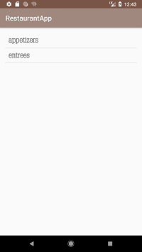

# Views

To enable interactions between computers and humans, usually some kind of **user interface** (UI) is provided. Examples of user interfaces are:

- touch screens that can measure touches by one or more fingers
- braille devices that output letters using mechanical dots
- text screens that can present a limited amount of characters
- graphical screens that can set very small dots to any of millions of colors
- keyboards that allow users to enter information using one or more discrete buttons

Graphical screens are often used for modern user interfaces. Even a simple device such as a learning thermostat has an advanced screen, albeit tiny, that can present very detailed graphics. Unsurprisingly, programmers are often in the business of creating **graphical user interfaces** (GUI).

Android, and many other systems, provide toolkits for creating GUIs. The first reason is to ensure that applications on the platform have a consistent look-and-feel, making it easier for users to work with apps from many different developers. The second reason is to make programmers' lifes easier: the toolkits contain many standard components that allow creating almost any user interface. It is therefore uncommon for programmers to write code that actually changes individual pixels on the screen. Instead, this code is hidden in the **components** that can be found in the toolkit.

## Activities

On Android, any single screen in an app is managed by an **activity**. Essentially, activities are the fundamental units into which developers decompose their application ideas. Each activity normally consists of the activity Java class that contains the code, as well as an XML document which defines the layout of the user interface. Here's an example of an app with three screens/activities:

  

## Layouts

Below is a screenshot of a simple login screen for an Android app. You can see the outlines for all individual components. The components in an Android activity screen are all **views**, and there are two subtypes: layouts and controls. **Layouts** do nothing but manage the location and layout of the screen. In the screen below, you can find a couple of `LinearLayout`s as well as a `FrameLayout`. While layouts are effectively invisible, **controls** are things on the screen that a user can see and often interact with. Some of the controls in the screenshot below are text fields and a button.

## Events

When users interact with controls, the framework translates these into **events**. Examples of events are key presses, mouse clicks or swipe gestures. Activities may contain **event handler** methods that define what is supposed to happen whenever such an event is triggered. In the XML layouts, event handlers are identified by their method name, making a direct connection between the layout and the `Activity` code.
