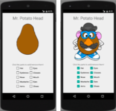
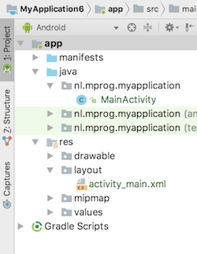
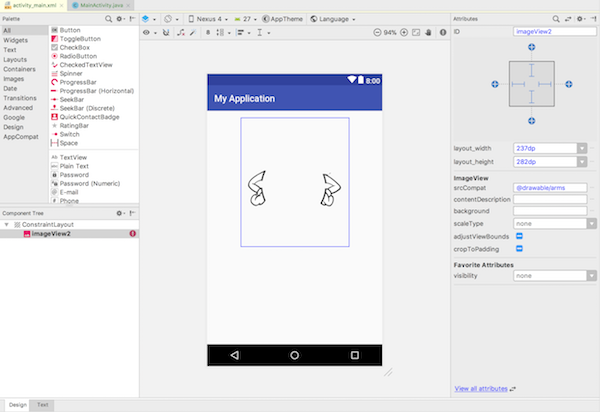
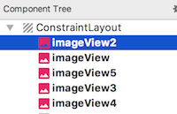

# Mr. Potatohead

## Objectives

- Create a first app!
- Practice with Git.
- Use layouts to design your user interface.

## Reference

- [State](/android-reference/state)
- [Git](/android-reference/git)

## Assessment

Your work on this problem set will be checked for full completion of the assignment and consideration of all requirements. Demo your application during office hours.

| pts | description                                                                          |  
| --: | ------------------------------------------------------------------------------------ |  
|   5 | Exceptional quality in use, layout and code. Probably something extra or unexpected. |  
|   4 | Solid quality in use, layout and code. Maybe some trivial error.                     |  
|   3 | Reasonable quality, but lots of room for improvement.                                |  
|   2 | The app works mostly but really lacks in quality.                                    |  
|   1 | Clearly some effort went into it, but it does not really work.                       |  
|   0 | Not submitted or very incomplete.                                                    |  

All students must ordinarily submit this and all other projects to be eligible for a satisfactory grade unless granted an exception in writing by the course's heads.

## Background

Imagine an app that displays a "Mr. Potato Head" toy on the screen. The toy has several accessories and body parts that can be placed on it, such as eyes, nose, mouth, ears, hat, shoes, and so on.

Initially your app should display only the toy's body, but if the user checks/unchecks any of the checkboxes below the toy, the corresponding body part or accessory should appear/disappear.

The way to display the various body parts is to create a separate view for each part, and lay them out so that they are superimposed on top of each other.

(thanks to Victoria Kirst for the original assignment idea and images!)

## Creating your first project

<iframe src="https://player.vimeo.com/video/211268587" width="320" height="200" frameborder="0" webkitallowfullscreen mozallowfullscreen allowfullscreen></iframe>

## Getting started

1.  Create a new Android studio project, using these settings:
    - Choose API 24 (Nougat) unless your own phone has an older operating system
    - Start with an Empty Activity which is called `MainActivity`
    - Leave all other settings unchanged

2.  Create a new, empty repository on the Github website. Name your repository `Mr Potatohead`.

3.  Now, add a git repository to the project on your computer. Go to Android Studio, and in the menu choose **VCS -> Enable Version Control Integration**. Choose **git** as the type and confirm. This will not change much, but sets us up for the next steps.

    Note: if you get a popup to ask whether you would like to add some file to the repository, answer "No" for now. If you answer "Yes", things may get complicated later on.

4.  Link the local repository to your Github project. Choose **VCS -> Git -> Remotes...**. Add a remote with name "origin". You can find the URL on the Github project you just created:

    

5.  Android Studio has generated quite a few files for your project already. To add these, let's **commit** and **push** those files to Github. Press **Cmd-K** or **Ctrl-K** to show the Commit Changes screen. There, you should see a long list of "unversioned files". Make sure all checkboxes are selected, enter a commit message `Initial project` and then press the **commit** button. Turn off code analysis.

6.  Press **Cmd-Shift-K** or **Ctrl-Shift-K** to show the Push Commits dialog. Press the **Push** button to send everything to Github.

Your project files should now be visible on Github like in the picture below. If not, ask for help!

## Really getting started

For this project, we'll only work with the two most important files in your Android project: `MainActivity.java`, which contains the back-end code for your main screen; and `activity_main.xml`, which contains the definition of what the main screen looks like. You'll find them in the project sidebar:

No need to create original art! Here's [image files](mr-potato-head-images.zip) for each body part and accessory, such as **body.png**, **ears.png**, **hat.png**. Let's add those to the project.

1. Just for a second, switch to the Project View using this dropdown:

    

2. Navigate to app -> src -> main -> res -> drawable. Now, drag the downloaded image files into that `drawable` folder. Android Studio will offer to move/copy them, and then to add them to your local git repository. That's all fine.

3. Jump back to the Android View using the same dropdown as in step 1. You can now use the images from your app.

## Creating the user interface

Let's now design the interface. We will try to mimic the picture at the top of this assignment as closely as possible.

1.  Double-click `activity_main.xml` in the project browser to open it. 

2.  Your view currently contains a `Label` with the text `Hello World!`. Click it and press delete to remove it from the screen.

3.  Now go to the Palette (remember where? it was in the video!). Drag an `ImageView` from the Palette to the screen layout. Immediately, a dialog pops up, allowing you to choose one of the `.png` files that you just added to the project. Start with the body!

4.  The image will resize to take up more of the screen. Reposition it to make it look right. Make sure to allow a bit of space along the borders. Android Studio should help you a little to keep nice margins.

5.  Make sure all the images are the same size and positioned right on top of each other. Currently, you can see all of them, but we'll make sure they are invisible when the app starts. Find the Attributes sidebar like in the screen shot below:

    

    For each of the images, set the `visibility` attribute to `invisible`. It is probably listed under "favorite attributes", but if you can't find it, choose "View all attributes" all the way down the Attributes sidebar.
    
    Tip: use the component tree to select the image views. You can even select multiple views and set the attributes for all of them:
    
    

6.  Now it's time to add checkboxes. Drag them from the Palette and set their `text` to mimic the screen shot from this assignment.

## Connecting everything with code

First, some final setup. Checkboxes can *do* something when clicked. Select one of the checkboxes, and in the attributes sidebar find the `onClick` attribute. Enter `checkClicked` as its value: this is the name of the method that will be called whenever someone selects or unselects the checkbox. Do this for all checkboxes.

1.  Now, switch to the code. Double-click `MainActivity` in the project browser.

2.  Add a method `checkClicked()` to the activity class:

    

3.  Now try your app! Run it on your phone or in the simulator. Your app should log something whenever you click one of the checkboxes. If not, ask for help!

Now, every single checkbox is connected to the same method. How do we figure out which one it is? We only have a single clue: the parameter `View v`. This parameter is a **reference** to our checkbox view on the screen (the one that was clicked). It is of type `View`, which is a superclass of `CheckBox`. It does not support all of the methods that `Checkbox` has.

1.  To access all methods from the `CheckBox`, we have to cast the parameter. Create a temporary variable to hold the `CheckBox`:

        CheckBox checkbox = (CheckBox) v;

    As you might remember, putting a type between rounded brackets will **cast** something to that type (if possible!). The important part: we are absolutely sure that we connected the `checkClicked()` method only to checkboxes, so this is a safe thing to do!

2.  Now that we have a variable of type CheckBox, we can call the method `getText()` on it. Remember from the layout that you set the `text` property of each checkbox? This is the same.

3.  To get the text of a checkbox as a simple `String`, call `checkbox.getText().toString()`. That's it! Oh, and to find out if the checkbox is checked or not, use the `isChecked()` method.

Finally, we need to be able to switch some of the images on and off, depending on the state of the checkboxes. 

1.  To set the visibility, you will need a reference to the image view that you would like to manipulate. Here's a sample:

        ImageView image = (ImageView) findViewById(R.id.arms);

    The idea (no pun intended) of `findViewById()` is that you specify the **R**esource id of your image view. When running on the phone, the Android system will then find it for you on the screen and provide you with a reference.
    
    What ID should you provide? This depends on the name that you have set for the view. Currently, your imageviews may have uninformative names such as `imageView2`. Best to head to the layout designer, click each of the image views, and set an appropriate name in the attributes sidebar. Tip: use the component tree to select each of the views.

2.  As soon as you have a reference to one of the images, you can set whether or not it (or any other control) is visible on the screen by calling its `setVisibility()` method. The `setVisibility` method accepts a parameter such as `View.VISIBLE` or `View.INVISIBLE`. There is also a `getVisibility()` method if you need to check whether a widget is currently visible.

## Finishing the app

There's only a little bit of Java code to write, in order to have each checkbox show and hide the corresponding image. Because we use lots of separate images, expect your code to be slightly inefficient in terms of lines of code! It's up to you how to handle each of the cases. Start simple though!

## Supporting rotation

There's a bug in your app! Because of how Android works, your layout may be reloaded whenever you leave your app, switch to another app, and then return. This way, memory usage can be kept low. Your layout may also be reloaded as the phone is rotated. However, even though your checkboxes will be automatically reloaded in the same state as you left them (checked/unchecked), your image views will not!

You can preserve this state by using the `onSaveInstanceState()` method. It is a method that you can optionally override in your activity. 

    public void onSaveInstanceState(Bundle outState) {
        super.onSaveInstanceState(outState); // always call super
        outState.putInt("name", value);
        outState.putString("name", value);
        ...
    }

You can use the `Bundle` to save items. This same bundle will be delivered to you when the layout is reloaded. Actually, that bundle was already in your activity! It is a parameter to the `onCreate()` method. So in `onCreate()`, you can use some methods to **restore** the state of your views:

    ... = savedInstanceState.getInt("name");
    ... = savedInstanceState.getString("name");

Now, your task is to save the `visibility` state of all `ImageViews`. Which get/put method seems appropriate to do this? Google "android bundle" to get a list of all get/put methods.

## How to submit

1. Add a `README.md` with screenshot and a brief description. Use Markdown to format your README, as supported by GitHub. The screenshot must be uploaded to your GitHub repository first! Do that nice and clean in a separate folder called `doc`.

2. Commit and push your code [per the instructions](/android/git).

3. Check if your project actually works for other developers! Go to the GitHub webpage for your repository and use the "Download zip" button. Unpack that zip somewhere unusual (your Desktop maybe?) and try to open and run the project.

4. When all is set, paste the GitHub repo URL in the textbox, below!
