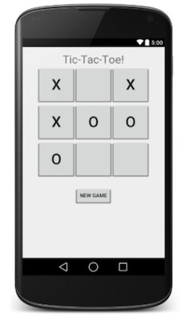

# Tic Tac Toe

## Objectives

- Practice with model classes.
- Create nice layouts.

## Background

Tic-tac-toe is a very simple game: you don't need much in terms of attributes, and the rules are simple. A perfect game to model into its own class!

Write a basic game of tic-tac-toe, where two players take turns pressing buttons in a 3x3 grid to mark "X" or "O" characters on them respectively. If any player can place three of their letter in a row horizontally, vertically, or diagonally, that player wins the game.
Setting up the buttons for the game is a good opportunity to practice using GridLayout. You'll probably want to set the buttons to have a large size so that they fill a large portion of the screen, as well as giving them a large font to make them easier to read and click.
If you want a simpler implementation, you can write your code as though two human players were playing it on the same screen; the first tap is an X move, the second is an O move, and so on. If you want more challenge, you could have the computer play as the second player. A simple strategy would be to just randomly move on any open square, but a more complex computer player would try to "block" the human player if the human has any two-in-a-rows and is one move away from winning the game.

## Getting started

1.  Create a new Android studio project, using these settings:
    - Choose API 24 (Nougat) unless your own phone has an older operating system
    - Start with an Empty Activity which is called `MainActivity`
    - Leave all other settings unchanged

2.  Create a new, empty repository on the Github website. Name your repository `Mr Potatohead`.

3.  Now, add a git repository to the project on your computer. Go to Android Studio, and in the menu choose **VCS -> Enable Version Control Integration**. Choose **git** as the type and confirm. This will not change much, but sets us up for the next steps.

    Note: if you get a popup to ask whether you would like to add some file to the repository, answer "No" for now. If you answer "Yes", things may get complicated later on.

4.  Link the local repository to your Github project. Choose **VCS -> Git -> Remotes...**. Add a remote with name "origin". You can find the URL on the Github project you just created:

    

5.  Android Studio has generated quite a few files for your project already. To add these, let's **commit** and **push** those files to Github. Press **Cmd-K** or **Ctrl-K** to show the Commit Changes screen. There, you should see a long list of "unversioned files". Make sure all checkboxes are selected, enter a commit message `Initial project` and then press the **commit** button. Turn off code analysis.

6.  Press **Cmd-Shift-K** or **Ctrl-Shift-K** to show the Push Commits dialog. Press the **Push** button to send everything to Github.

Your project files should now be visible on Github like in the picture below. If not, ask for help!

## Creating the game

- create the 2 enums

- create `public class GamePlay`

        int BOARD_SIZE = 3;
        int[][] board;

        Boolean playerOneTurn;
        int movesPlayed;
        Boolean gameOver;

- 

