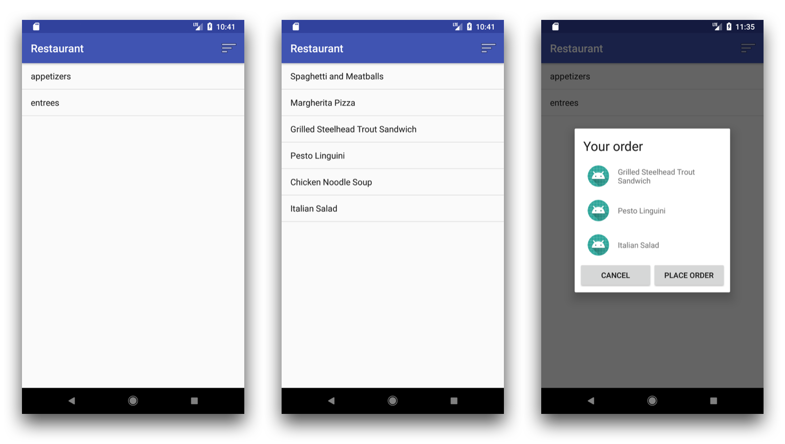
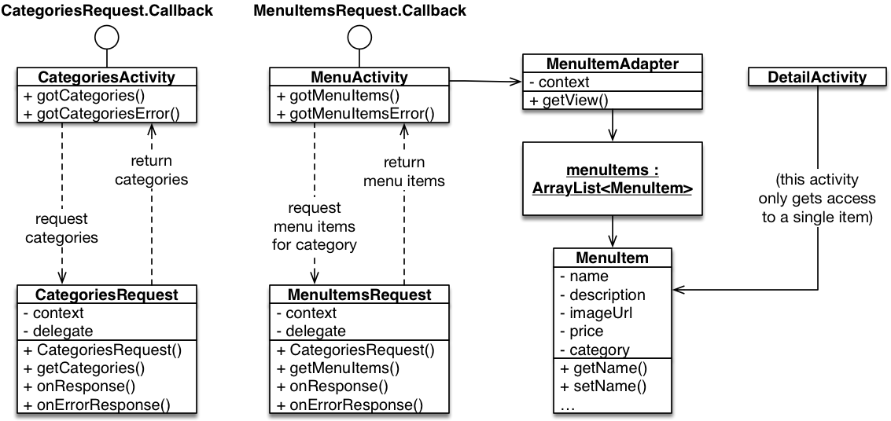
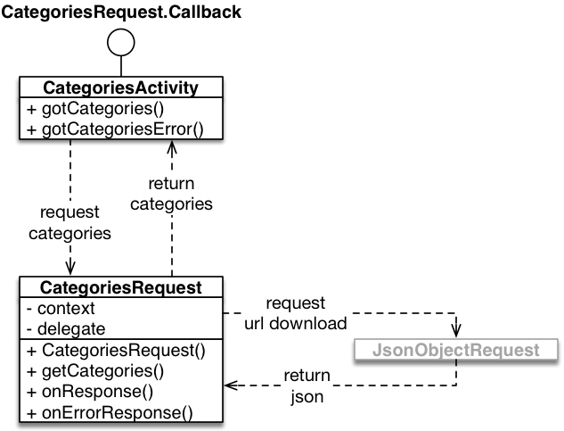

# Restaurant

## Objectives

- Practice with user interface design.
- Practice with presenting information in lists.
- Learn to use an `interface` to perform a callback.
- Practice using `Volley`.
- Practice with online APIs with JSON.

## Background

Create an app that will help users look at a restaurant's menu and view the details of the items in the menu. Of course, they must be able to view the price of items, the description and an image as well, all of which should be retrieved from an API. In order to communicate elegantly with the API, the code to do this will be contained in separate classes. This way the code that handles the UI will be separate from the code that retrieves data from the API. 

## Restaurant API

The API we will use for this assignment is available at: <https://resto.mprog.nl/>

The following **endpoints** are available:

* `/categories`: A GET request to this endpoint will return an array of strings of the categories in the menu. The array will be available under the key "categories" in the JSON.
* `/menu`: A GET request to this endpoint will return the full array of menu items, but it can also be combined with the query parameter, category, to return a subset of items. The array will be available under the key "items" in the JSON.

Tip: try the API in your webbrowser. Enter the address of the `categories` endpoint and see how it responds.

## Getting started

1.  Create a new Android studio project called **Restaurant**, using these settings:
    - Choose API 24 (Nougat) unless your own phone has an older operating system
    - Start with an Empty Activity which is called `CategoriesActivity` 
    - Leave all other settings unchanged

2.  Create a new, empty repository on the Github website. Name your repository `Restaurant`.

3.  Now, add a git repository to the project on your computer. Go to Android Studio, and in the menu choose **VCS -> Enable Version Control Integration**. Choose **git** as the type and confirm. This will not change much, but sets us up for the next steps.

    Note: if you get a popup to ask whether you would like to add some file to the repository, answer "No" for now. If you answer "Yes", things may get complicated later on.

4.  Link the local repository to your Github project. Choose **VCS -> Git -> Remotes...**. Add a remote with name "origin".

5.  Android Studio has generated quite a few files for your project already. To add these, let's **commit** and **push** those files to Github. Press **Cmd-K** or **Ctrl-K** to show the Commit Changes screen. There, you should see a long list of "unversioned files". Make sure all checkboxes are selected, enter a commit message `Initial project` and then press the **commit** button. Turn off code analysis.

6.  Press **Cmd-Shift-K** or **Ctrl-Shift-K** to show the Push Commits dialog. Press the **Push** button to send everything to Github.

Your project files should now be visible on Github. If not, ask for help!

## Architecture

Here's a general overview of the app architecture. There will be three activities, two of which make a connection to the online API. There's also a model class for menu items, and an adapter for displaying those on the menu screen.

## 1. Showing categories

To prepare, add a simple ListView to your `CategoriesActivity` user interface. Make sure it is well-positioned. That's all there is to it! However, to make the app really work, we will need to fill the list with data from the restaurant server.

Have a look at the extended diagram below. What we'll be doing is create a specialized request class (`CategoriesRequest`), which downloads data from the server and transforms this to a nice list of strings. Downloading the data is delegated to a `JsonObjectRequest`, which is provided to us by the Android framework.

The general idea is that we should be able to create an object of type `CategoriesRequest`, and call its `getCategories()` method. This will start a download using an object of type `JsonObjectRequest`. Because downloading is never instantly, data is not instantly returned, but instead provided using a **callback method**. The `JsonObjectRequest` expects to be able to call these two callback methods:

- `onResponse(response)`, which is called when everything goes as expected, and the `response` parameter will contain a `JSONObject` containing the document

- `onErrorResponse(error)`, which is called when something goes awry, and the `error` parameter will contain a `VolleyError` containing, among other things, an error message

We'll use the same idea for our own `CategoriesRequest` class. It expects to be able two call either of two methods. These methods will be predefined in an **interface**, which you need to place at the top of the `CategoriesRequest` class:

    public interface Callback {
        void gotCategories(ArrayList<String> categories);
        void gotCategoriesError(String message);
    }

Now, create the remaining parts of the `CategoriesRequest` class:

- Write a constructor that accepts a `Context` type parameter. This context is needed for sending internet requests.

- Define a method `getCategories(Callback activity)`. This method will attempt to retrieve the categories from the API, and if succesful, will notify the activity that instantiated the request that it is done through the callback. This is why we pass a reference to the activity as an argument, so that when the API request is done, it knows what activity to notify.

- Within this method, use [`Volley`](https://apps.mprog.nl/android-reference/volley) to create a new `RequestQueue`, which takes the context we passed in the constructor as an argument. 

        RequestQueue queue = Volley.newRequestQueue(context);

- Then we will want to create a `JsonObjectRequest`, since the data we want from the API comes in the shape of a JSON object. This can be done through the following lines of code:

        JsonObjectRequest jsonObjectRequest = new JsonObjectRequest(..., ..., ..., ...);
        queue.add(jsonObjectRequest);

The `JsonObjectRequest` takes 4 arguments: the url that the request should be submitted to, a JSON object that should be added to the API call (if any, so this can be null), and two listeners. Since we need to know whether the request succeeded or not, we will need to implement two listeners that trigger when the request succeeded or failed, respectively. 

- To add functionality to these listeners, make your activity implement them:

        public class CategoriesRequest implements Response.Listener<JSONObject>, Response.ErrorListener

- Use **CTRL+I** to generate the appropriate code. You now have two methods in your activity: `public void onErrorResponse(VolleyError error)` and `public void onResponse(JSONObject response)`. Effectively, your activity class now functions as the listener, since the appropriate handler methods are implemented by it. 

- This also means that in your code to generate the `JsonObjectRequest` you can pass `this` (referring to the activity) as the listeners needed for 3rd and 4th argument.

### React to a response from the API call

Now that the base code for the listener functionality is present, we still need to actually do something when we receive a response from the API. In the `onResponse` method, we will want to transform the `JSONObject` in our response to an `ArrayList` that holds elements of the `String` type. 

- Look at the formatting of your response (remember you can request the same JSON output in your browser) and create a loop that will extract the categories present in the response. Since they are in a JSON array, chances are you want to use `getJSONArray()` to grab that array.

> Some JSON responses can be confusing at first glance, especially if not formatted clearly. You can always use a JSON Formatter (there are many available on the web, just Google for it) to show you the data in a more clear manner and help you determine how to extract what you want from it.

- Once the JSON array is extracted, you can loop over it to extract the items in it: the categories we were looking for and fill the `ArrayList<String>` with these items. 

- When the `ArrayList` has been filled, use the reference to the activity that we received earlier as an argument of `getCategories(Callback activity)` to call the method `gotCategories` and pass the list that you just made as an argument. This way the activity will also have access to the list, but only when it's certain that the API call has finished and the list is ready!

As of now, we only report back to the calling activity when we succesfully retrieve data from the API, but this could very well go wrong at some point. It might be tempting to do nothing at all with our `onErrorResponse` method, but it's bad practice to ignore errors and exceptions! 

- In the `onErrorResponse` method, use the reference to the activity to call the other method defined in the interface: `gotCategoriesError`. 

- Since we want to know what the error was, we will pass the contents of the error as a string back to the activity through `gotCategoriesError`. Since the `onErrorResponse` method receives the error that caused the request to fail as its argument, we can use `error.getMessage()` to get these contents. 

> When handling exceptions in apps, it's good to let the user know when something did not go as expected. It's not always needed to show them all the technical details of the error, but an app that silently fails and gives no feedback on what went wrong is frustrating to use. 

### Handle the callbacks in CategoriesActivity
We have our listeners and made them pass on the list of categories or error, but the activity does not implement the functiality to handle the callbacks yet. The methods defined in the `interface` in `CategoriesRequest` need to be implemented by the activity. This way, when the API request is finished or has failed and one of the methods in the interface is called through the activity reference that the `CategoriesRequest` class received, the corresponding methods in the activity are called. The ArrayList with categories can be passed to the activity and we can create and set our adapter as usual. 

- Add `implements CategoriesRequest.Callback` to the class declaration of `CategoriesActivity`. Red wriggly lines now appear, so hit `CTRL+I` to implement the methods that are defined in the `Callback` interface: `gotCategories()` and `gotCategoriesError()`

- In `gotCategories`, create a new `ArrayAdapter<String>` from the list of categories. Attach the adapter to your listview (remember how?).

- In `gotCategoriesError`, create a `Toast` message showing the error to your user, so they know wat went wrong (hopefully).

Try out your app now! It should show the categories. Did something go wrong? Maybe you need to add an `INTERNET` permission to your app!

## 2. Showing the menu

When someone taps a category in the main screen, the app should load the menu items for that category. We'll use a new activity for this!

- Create `MenuActivity`. Add a ListView.

- Now, first make a model class called `MenuItem` with the following fields. Create getters and setters for all fields (`Alt+Ins` or `Ctrl+N`).

    - name
    - description
    - imageUrl
    - price
    - category

- Just like you did for `CategoriesActivity`, create a request class that will retrieve the menu items for this category. Instead of retrieving a list of strings, make sure that the class provides us with an `ArrayList<MenuItem>`, with all the item fields properly filled from the JSON object.

- In your `CategoriesActivity`, implement `AdapterView.OnItemClickListener` and override (CTRL-O) the `onItemClick` method. In that method, open `MenuActivity` by way of an intent, making sure that you provide via `putExtra` a string with the category name.

- In your `MenuActivity`'s `onCreate`, retrieve the category string and make sure that this string is part of the request for menu items.

- Implement `MenuItemsRequest.Callback` and the `gotMenuItems` method. In this case, we would like to implement a **custom view** for the adapter, which will display as much info about the menu items as possible, including a picture!

Hopefully by now, your app will not only show categories, but menu items as well!

## 3. Showing the details

Now, when someone taps an item in the menu, we'd like to show a bit more detail. For this, we'll create a third activity.

- Create `MenuItemActivity`, with a nice layout for all information that we have about a `MenuItem`.

- Connect `MenuActivity` to the `MenuItemActivity` by adding an `OnItemClickListener` to the former's list view, and sending the right `MenuItem` via a `putExtra`.

- In the `MenuItemActivity`, make sure that all information is loaded from the `MenuItem` into the right UI controls.

Done!

## Tips

- Consider viewing the JSON from the server in a [JSON formatter](https://jsonformatter.curiousconcept.com/) to have a better overview of what data is present in the response.

- To use the JSON responses in your code and get the values you need, Android has some nifty built-in functionality on which you can find the docs [here](https://developer.android.com/reference/org/json/package-summary.html).

## Designing the user interface

How do you create a UI that fits well into the platform you're using? Peruse the interface guidelines and see. Check out the [Material Design Documentation](https://developer.android.com/design/index.html)
	- especially [the components section](https://material.google.com/components/bottom-navigation.html) (find more about lists, for example, in the sidebar)
	- and [the patterns section](https://material.google.com/patterns/confirmation-acknowledgement.html) (find more about navigation, for example, in the sidebar)

Each of these guides provides clear recommendations of how apps are supposed to look and behave for users. If apps behave consistently with other apps, this makes them easier to learn for the user. Make sure you use these guides to choose appropriate user interface elements; for example, how should a search function normally work on your platform?
