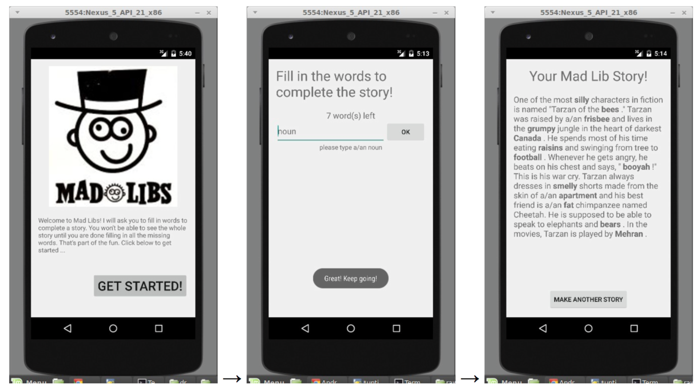

# Multiple Screens

*Due: Sunday night, April 24, 2016.*

## Objectives

- File reading
- Pass data between Activities
- Support multiple screen rotations

The purpose of this assignment is to practice the material from the past few weeks, such as apps with multiple screens, apps that handle instance state and data.

## Preparation

## Grading

Submit your program as part of a new repository! Your submission will be graded quickly by simply running it and evaluating its functionality, and checking out its code.

## Mad Libs

[Here are some files to use as resources!](madlibs-files.zip)

"Mad Libs" are short stories that have blanks called placeholders to be filled in. In the non-computerized version of this game, one person asks a second person to fill in each of the placeholders without the second person knowing the overall story. Once all placeholders are filled in, the second person is shown the resulting silly story.

Write an Android app that reads in a Mad Lib from a text file in a specific format. The text file represents placeholders as tokens that start and end with `<` `>` brackets, like `<adjective>` or `<proper-noun>`. Your app reads the file, looks for any such placeholders, and prompts the user to replace them with specific words. Once the user has typed in replacements for all placeholders, the completed story is shown on the screen. The screenshots below indicate a possible flow of the UI for such an app. Our flow has three activities: An initial "welcome" screen explaining the app, then a screen that repeatedly prompts the user to fill in placeholders, then a third activity to display the completed story. Of course you don't need to exactly match our sample's UI, but it may give you ideas.

On the course web site we provide several Mad Lib story text files you can use, such as **madlib1_tarzan.txt**. Here is the text of that file, to give you an idea of the Mad Lib format:

    One of the most <adjective> characters in fiction is named "Tarzan of the
    <plural-noun> ." Tarzan was raised by a/an <noun> and lives in the
    <adjective> jungle in the heart of darkest <place> . He spends most of his
    time eating <plural-noun> and swinging from tree to <noun> . Whenever he
    gets angry, he beats on his chest and says, " <funny-noise> !" This is his
    war cry. Tarzan always dresses in <adjective> shorts made from the skin of
    a/an <noun> and his best friend is a/an <adjective> chimpanzee named
    Cheetah. He is supposed to be able to speak to elephants and <plural-noun>
    . In the movies, Tarzan is played by <person's-name> .

The code for reading the story text file, breaking it apart, looking for the placeholders, etc. is not particular to Android, so perhaps it is less relevant to this course. To make the assignment more manageable, if you want a head start toward implementing this particular option, we'll give you a file on the course web site called **Story.java** that you can optionally use as a building block. If you put **Story.java** into your project, you can construct a `Story` object and pass it an input stream or Scanner and it will read the text data from that source, break the text apart, and find the placeholders for you, etc. The Story object has other methods for filling in the placeholders later. If you use this helper object, you can focus more on the "Androidy" parts of this assignment and less on the string / text processing parts. Or if you want to try to write the story parsing logic yourself, that is fine.

## Requirements

- make sure the app works both in landscape and portrait modes
- other requirements are as specified in the assignment above
