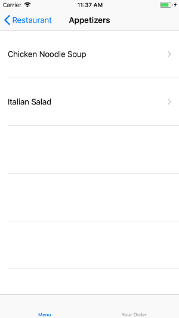

# Restaurant

## Objectives

- Practice with user interface design.
- Practice with presenting information in lists.
- Practice with online APIs with JSON.

## Preparation

- Learn about [Listeners](/android/listeners).
- Learn about [Persistence](/android/persistence).
- Learn about [Lists](/android/lists).
- Learn about [Volley](/android/volley).

## Assessment

Your work on this problem set will be checked for full completion of the assignment and consideration of all requirements. Demo your application during office hours.

All students must ordinarily submit this and all other projects to be eligible for a satisfactory grade unless granted an exception in writing by the course's heads.

## What to do

Create an app that will help users look at a restaurant's menu and compose an order of items, as well as allow them to "submit" the order and receive an estimated waiting time for this order. Of course, they must be able to view the price of items, the total price of the order and be able to remove items from the order as well! All of this should be done using an elegant and simple user interface. Below you will find an idea of how this could look.

  

## Restaurant API

The API we will use for this assignment is available at: <https://resto.mprog.nl/>

The following **endpoints** are available:

* `/categories`: A GET request to this endpoint will return an array of strings of the categories in the menu. The array will be available under the key "categories" in the JSON.
* `/menu`: A GET request to this endpoint will return the full array of menu items, but it can also be combined with the query parameter, category, to return a subset of items. The array will be available under the key "items" in the JSON.
* `/order`: A POST to this endpoint with the collection of menu item id values will submit the order and will return a response with the estimated time before the order will be ready. The IDs you send need to be be contained with JSON data under the key, menuIds. When you parse the JSON, an estimate of the time before the order is ready will be under the key "preparation_time".
* `/images`: Will return the URL of an image. Make sure to handle 404 errors correctly!

## Functional requirements

Your task is to build an app according to the description above. On top of that, there are some specific requirements to take into account:

- Your app should somehow display to the user the current amount of items in the order.

- Your app should persist the list of dishes in the order, even when quitting and re-opening the app.

## Technical requirements

- The app must properly display on devices of various dimensions.

- The app must properly support rotation of the user interface (no data loss).

- The app must use the concepts from the "Preparation" section, above.

- The app should use standard `ListViews` combined with an adapter.

- The app's back navigation should always be simple.

- `onClick` and similar listeners may not be "anonymous".

## Getting started

1. Create an empty [GitHub](https://www.github.com/) repository to manage your code.

2. Create a new project, using this pattern as a name: `studentname-pset3`.

3. Share your project on GitHub.

4. Remember to commit and push all important changes you make!

## Tips

- Consider viewing the JSON from the server in a [JSON formatter](https://jsonformatter.curiousconcept.com/) to have a better overview of what data is present in the response.

- To use the JSON responses in your code and get the values you need, Android has some nifty built-in functionality on which you can find the docs [here](https://developer.android.com/reference/org/json/package-summary.html).

- To store the order in your app and make sure it persists after it has been killed, you can use `SharedPreferences`. `SharedPreferences` makes use of key-value pairs, so perhaps it could be useful to you to map the name of the dish (as a key) to the amount someone wants to order (the value), with the `putInt()` method. For more on `SharedPreferences`, refer to [this guide](/android/persistence).

- For some interaction with the API, you will need to use `POST` instead of `GET`. For this you can use the [Volley Library](https://developer.android.com/training/volley/simple.html) as well!

## Designing the user interface

How do you create a UI that fits well into the platform you're using? Peruse the interface guidelines and see. Check out the [Material Design Documentation](https://developer.android.com/design/index.html)
	- especially [the components section](https://material.google.com/components/bottom-navigation.html) (find more about lists, for example, in the sidebar)
	- and [the patterns section](https://material.google.com/patterns/confirmation-acknowledgement.html) (find more about navigation, for example, in the sidebar)

Each of these guides provides clear recommendations of how apps are supposed to look and behave for users. If apps behave consistently with other apps, this makes them easier to learn for the user. Make sure you use these guides to choose appropriate user interface elements; for example, how should a search function normally work on your platform?

## How to submit

1. Add a `README.md` with screenshot and a brief description. Use Markdown to format your README, as supported by GitHub. The screenshot must be uploaded to your GitHub repository first! Do that nice and clean in a separate folder called `doc`.

2. Commit and push one last time (hopefully!).

3. Check if your project actually works for other developers! Go to the GitHub webpage for your repository and use the "Download zip" button. Unpack that zip somewhere unusual (your Desktop maybe?) and try to open and run the project.

4. When all is set, paste the GitHub repo URL in the textbox, below!
