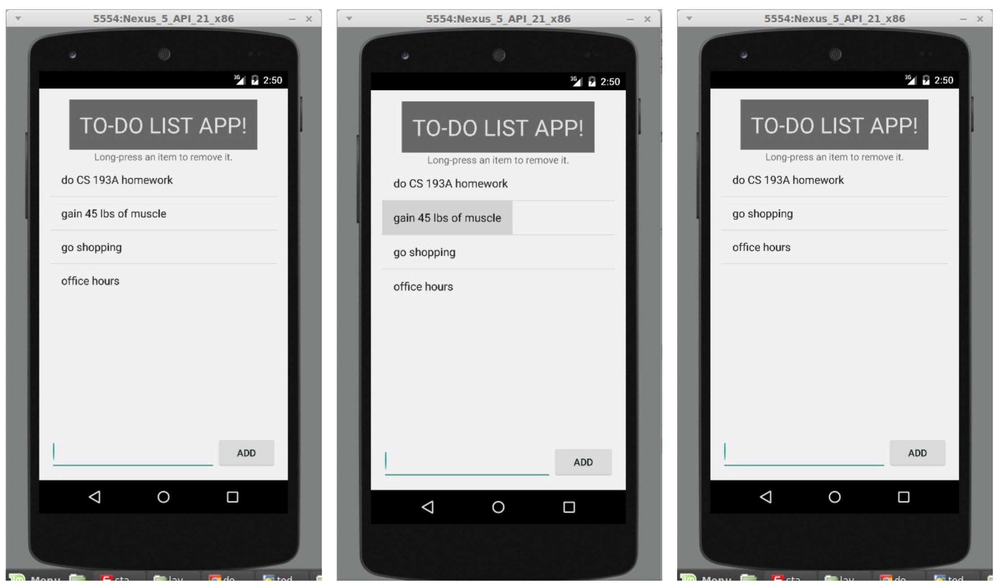
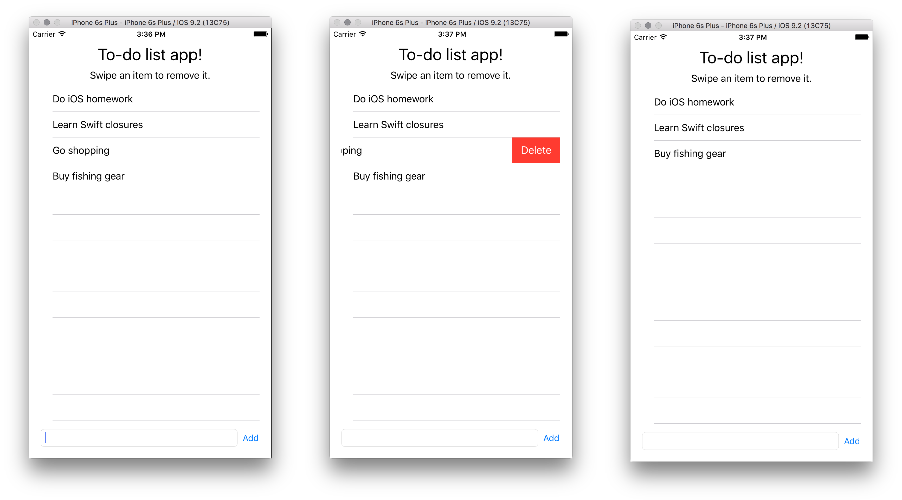

# To-do List

*First deadline: Tuesday, 7 March, during class (2 points).*  
*Second deadline: Tuesday, 14 March, during class (1 point).*

## Objectives

- Save data between sessions.
- Make sure that your app returns to the previous screen, no matter what.
- Use SQLite.

## Preparation

- On Android: read about [SQLite](/android/sqlite), the [activity life cycle](/android/lifecycle) and [data persistence](/android/persistence).
- On iOS: watch the demo about [SQLite](/ios/sqlite) and [state restoration](/ios/state).

## Assessment

Your work on this problem set will be checked for full completion of the assignment and consideration of all requirements. Demo your application during office hours.

All students must ordinarily submit this and all other problem sets to be eligible for a satisfactory grade unless granted an exception in writing by the course's heads.

## I forgot to do...

This week you will write a simple to-do list app that has a list of tasks that the user needs to complete. Initially the app contains three sample to-do items that explain how the app works. If the user types text into a bottom input field and clicks an *Add* button, the new item will be added to the top or bottom of the list. Of course, users must be able to check off *and* delete items, as well!

## Requirements

Your task is to build an app according to the description above. On top of that, there are some specific requirements to take into account:

- There are various methods to achieve deleting and checking off. It is up to you to present this in a user-friendly manner.

- You must make the app as robust as possible: todos must be saved in a database so as to ensure that to-do items survive when the app is killed or the phone rebooted.

- Your app should support, in a user-friendly way, rotation of the device.

## Getting started

1. Create a new empty GitHub repository.

2. Create a new project, using this pattern as a name: `studentname-pset4`.

## Tips (Android)

- The todos should be displayed as a `ListView` of tasks that the user needs to complete. If the user types text into a bottom `EditText` and clicks an *Add* button, the new item will be added.

- A common way to allow deletion in lists is to respond when the user performs a "long click" (pressing and holding on an item). You can do this by calling the `setOnItemLongClickListener` method of your list and passing an anonymous `AdapterView.OnItemLongClickListener` instance. Android Studio can help you auto-generate the skeletons of these anonymous listener classes if you press *Ctrl-Space* in the editor at the right place in the code.

	

	*Figure: User long-clicking on second list item to delete it*

- If the items in your to-do list are stored into an `ArrayList`, the app's GUI won't notice when you add or remove an item from the list. That is, you'll modify the `ArrayList` state but the graphical list on the screen won't update to match. To fix this, you have to call the method `notifyDataSetChanged()` on your `ArrayAdapter` to tell it that the underlying array list has changed. To be able to do this, of course, you'll have to save your `ArrayList` and your `ArrayAdapter` as private fields inside your activity.

- Use a `Bundle` to save the list's data during rotation.

## Tips (iOS)

- The to-dos will be displayed as a `Table View` of tasks that the user needs to complete. If the user types text into a bottom `Text Field` and clicks an Add button, the new item will be added.

- It's also good to have a way to remove items from the list. You could achieve this with the `commitEditingStyle` delegate function.

	

	*Figure: User swiping on the third list item to delete it.*

- Make sure you connect your table view with the datasource and delegate from the Storyboard to your Swift-file.

## How to submit

1. Add a `README.md` with screenshot and a brief description. Use Markdown to format your README, as supported by GitHub. The screenshot must be uploaded to your GitHub repository first! Do that nice and clean in a separate folder called `doc`.

2. Commit and push one last time (hopefully!).

3. Check if your project actually works for other developers! Go to the GitHub webpage for your repository and use the "Download zip" button. Unpack that zip somewhere unusual (your Desktop maybe?) and try to open and run the project.

4. When all is set, paste the GitHub repo URL below, in the textbox!
