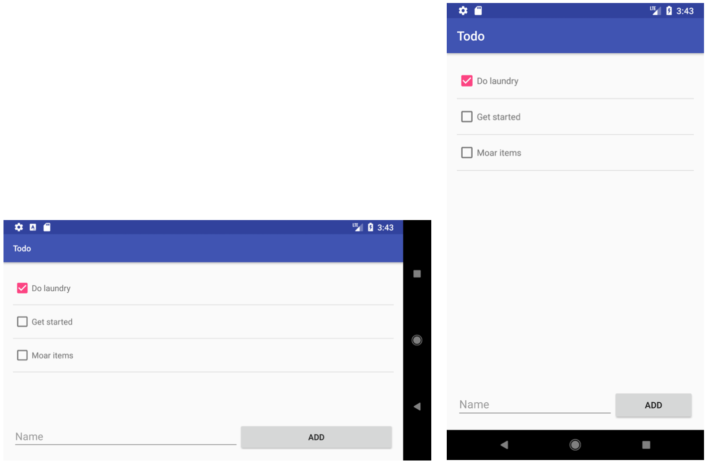
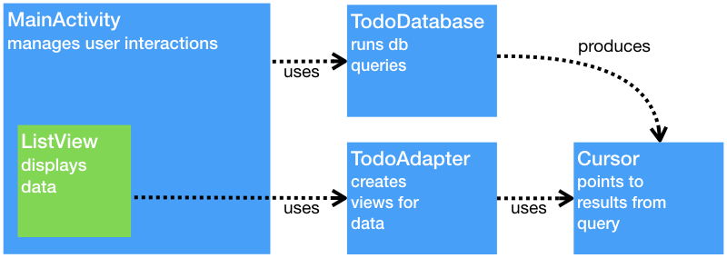

# To-do List

## Objectives

- Save app data between sessions.
- Make sure that your app returns to the previous screen, no matter what.
- Use SQLite.
- Clean up your code.

## Preparation

<!-- - [Models](/android/models) -->
- [SQLite](/android/sqlite)
- [Singleton](/android/singleton)

## Assessment

Your work on this problem set will be checked for full completion of the assignment and consideration of all requirements. Demo your application during office hours.

All students must ordinarily submit this and all other projects to be eligible for a satisfactory grade unless granted an exception in writing by the course's heads.

## The things I really ought to do

This week you will write a simple to-do list app that has a list of tasks that the user needs to complete. Initially the app contains three sample to-do items that explain how the app works. If the user types text into a bottom input field and clicks an *Add* button, the new item will be added to the top or bottom of the list. Of course, users must be able to mark items as "done", and delete them as well!

## Functional requirements

Your task is to build an app according to the description above. On top of that, there are some specific requirements to take into account:

- Your app should properly display on devices of various dimensions.

- Your app should properly support rotation of the user interface (no data loss).

- Every to-do item needs to have *at least* `title` and `completed` fields, additional fields may be implemented as well.

- The user interface should clearly represent whether a todo item has been marked as "done" (using a custom list view layout).

- Users must be able to mark items as complete and delete them.

- Allow marking of items as done by responding to a simple tap on the item itself.

- Allow deletion of items through a "long click" (pressing and holding on an item). Use the `setOnItemLongClickListener` method of your list. However, do not use anonymous listeners!

<!-- ## Technical requirements

- The to-dos should be displayed as a `ListView` of tasks that the user needs to complete.

- To-dos must be represented in your code by a model class.

- To-dos must be saved in a SQLite database so as to ensure that to-do items survive when the app is killed or the phone rebooted.

- Your app's readme should show the [Better Code Hub](/guides/better-code-hub) badge. No need to refactor your code, though! -->

## Class design

We'll keep the app pretty simple, structure-wise. There is only one activity, and we create two helper classes.

- The activity contains a `ListView` which, as before, uses an `Adapter` to generate the rows, but this time, we'll write our own adapter class.
- The activity also uses a database, which we will embed in a special `TodoDatabase` class. That class will have methods that specifically handle the data for to-do items.
- One important function of the database class is querying the database for all current to-do items, so as to fill the list. The query results are passed to our adapter via a `Cursor`. We do not implement the `Cursor` class ourselves, but instead rely on the standard `Cursor` class that Android provides.
- Although this app only uses a single activity, the database class is made as a **singleton**, which allows us to keep the database connection as the user navigates our app.

## Step 1: Getting started

- Create a new empty GitHub repository.
- Create a new Android studio project and link it to the repository.
- Design the `MainActivity`, adding a `ListView`, and a `EditText` with a `Button`.
- Make sure the layout works for small and large phones.

## Step 2: Create the database class

- Go to **File** > **New** > **Java Class**.
- Name the class `TodoDatabase` and fill in the superclass `android.database.sqlite.SQLiteOpenHelper`. Press OK to create the file.
- The file can't compile at this moment, because we haven't provided implementations for the required methods. Press **CTRL-I** to open up the **Implement Methods** dialog. Two methods are already selected: press OK.
- Finally, we need to create the right constructor for our class. Then press **CTRL-O** to open up the **Override Methods** dialog. Choose the simplest constructor (the topmost) and press OK.
- Implement `onCreate()`: write code that creates a table called `todos` with columns `title` and `completed`. Also add an `_id` column of type `INTEGER PRIMARY KEY`. Execture the SQL using the `sqliteDatabase.execSQL()` method.
- Add code in `onCreate()` that creates three sample to-do items for testing purposes.
- Implement `onUpdate()`: write code that drops the table and recreates it by calling `onCreate()`.

Tip: use 0 (false) and 1 (true) as values for booleans in the database!

## Step 3: Make it a singleton

We'll convert the `TodoDatabase` class into a Singleton.

- First, make the constructor `private` instead of `public`.
- Then, add a private **static** variable called `instance` of type `TodoDatabase`. This is where the unique instance of the class is stored, once made.
- Then, add a public **static** method called `getInstance()` which should accept a parameter of type `Context`. This method should return the value of `instance` if available, and otherwise call the constructor that is now private, providing the right parameters, and storing that in `instance`.
- To ensure that everything is in order, place the following line at the bottom of your `MainActivity`'s `onCreate()` method:

        TodoDatabase db = TodoDatabase.getInstance(getApplicationContext());

You project should now compile and run successfully, though data is not yet displayed.

## Step 4: Write the select method

- Write `selectAll()` in `TodoDatabase`. First, use `getWritableDatabase()` to open up the connection. Use the method `rawQuery` from that object to run a `SELECT * FROM todos` query and `return` the `Cursor`.
- Create a new layout `row_todo.xml`, which will be used to render each row in our list view. As such, it needs to contain controls for at least the title of a to-do item, as wel as something to show if the to-do has been completed or not.
- Create a new class `TodoAdapter` inheriting from `ResourceCursorAdapter`. Implement a constructor `public TodoAdapter(Context context, Cursor cursor)`. Call `super` and pass on the `context` and the `cursor`, and also the `id` of the layout that you just made. Tip: layout IDs start with `R.layout` and not `R.id`!
- Implement the abstract method `bindView()`, which takes a `View` and fills the right elements with data from the cursor.
     - Use `Cursor.getInt(columnIndex)` to retrieve the value of one column as an integer.
     - Use `Cursor.getColumnIndex(name)` to get the column index for a column named `name`.
     - Call `view.findViewById()` to get references to the controls in the row layout.
- In the `onCreate()` of the `MainActivity`, use the `TodoDatabase` to get all records from the database, make a new `TodoAdapter` and link the `ListView` to the adapter.

The app should now display all example to-dos from the database!

## Step 5: Write the insert method

- First, link the button in the `MainActivity` to a new method called `addItem`.
- In the database class, add a public method `insert()` which accepts a title and the completed status for a single to-do item.
- In that method, open a connection to the database (see step 4), and create a new `ContentValues` object. Use the `put` method to add values for `title` and `completed`. Then, call `insert` on the database connection, passing in the right parameters (`nullColumnHack` may simply be `null`).
- Now go back to the activity, use `TodoDatabase.getInstance()` to get to the database object, and call the `insert` method that we just defined.

## Step 6: Make sure the user interface keeps updated

To make sure that the list view always displays the most up-to-date information from the database, we are going to update it every time we change something.

- In your activity, create a `private` method called `updateData()`.
- You will need access to the database, as well as to the adapter. Add private instance variables to your class: `TodoDatabase db` and `TodoAdapter adapter`.
- In your `onCreate()` you already create an instance of the `TodoDatabase` and of the `TodoAdapter`. Change the code to save these instances to the instance variables that we just created.
- Now we can write the body for the method `updateData()`. You can use the method `swapCursor()` on the adapter to put in a new cursor for the updated data. Where do you get that new cursor? Just call `selectAll()` on the database again, as you dit in `onCreate()`.
- Call your new method right after calling `insert()` from the button `onClick` handler, and every time you add a new item, it should be displayed immediately!

## Step 7: Write the update method

- Add an `OnItemClickListener` private subclass to your `MainActivity`.
- In `onCreate()`, add a new instance of your subclass to the `ListView` via `setOnItemClickListener()`.
- In the database class, add a public method `update()` which accepts a `long id` and an updated completed status for some item.
- In the `update()` method, get a reference to the writable database. Create a `ContentValues` object that contains the new value for `completed`. Then call `update()` on the database. Tip: use the `whereClause` to specify which record you want to update: `"_id = " + id`.
- In your `ItemClickListener`, call your new `update()` method.

Don't forget to call `updateData()`!

## Step 8: Write the delete method

- Add an `OnItemLongClickListener` private subclass to your `MainActivity`.
- In `onCreate()`, add a new instance of your subclass to the `ListView` via `setOnItemLongClickListener()`.
- In the database class, add a public method `delete()` which accepts a `long id`. Call `delete()` on the database, providing the needed parameters.
- In your `ItemClickListener`, call your new `delete()` method.

Everything should work now!

## Step 9: Better Code Hub

If everything is in order, the code that you wrote should be pretty simple! A couple of classes, each not too long. Let's confirm this by using [Better Code Hub](/guides/better-code-hub). Connect the project to the site and add the code quality badge to your app's `README` on GitHub. If something seems seriously wrong, ask a teacher how to improve!

## How to submit

1. Add a `README.md` with screenshot and a brief description. Use Markdown to format your README, as supported by GitHub. The screenshot must be uploaded to your GitHub repository first! Do that nice and clean in a separate folder called `doc`.

2. Commit and push one last time (hopefully!).

3. Check if your project actually works for other developers! Go to the GitHub webpage for your repository and use the "Download zip" button. Unpack that zip somewhere unusual (your Desktop maybe?) and try to open and run the project.

4. When all is set, paste the GitHub repo URL below, in the textbox!
