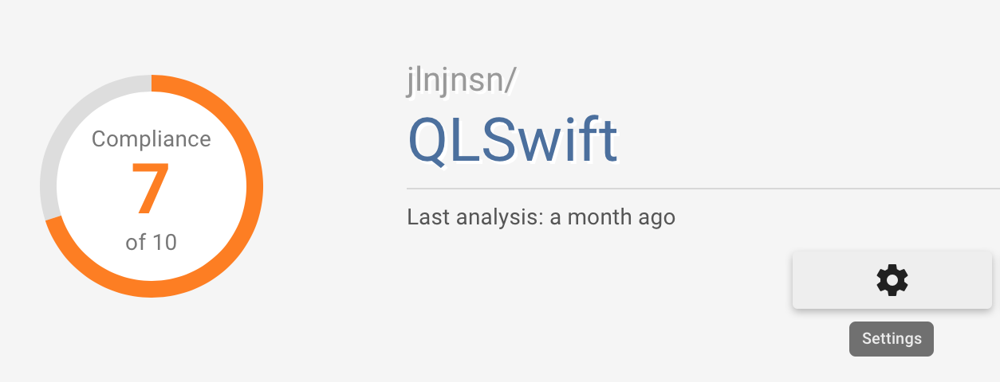

# Better Code Hub

During the last week you will work on improving the quality of your code. To guide you in this task, you use [Better Code Hub](https://www.bettercodehub.com). This website analyzes your repository along 10 guidelines for maintainability:

- Write Short Units of Code
- Write Simple Units of Code
- Write Code Once
- Keep Unit Interfaces Small
- Separate Concerns in Modules
- Couple Architecture Components Loosely
- Keep Architecture Components Balanced
- Keep Your Codebase Small
- Automate Tests (You can ignore this guideline for now, since it is not in the scope of this course.)
- Write Clean Code

Within Better Code Hub you can read up on these guidelines. If you want more in-depth information, take a look at the "[Building Maintainable Software](http://shop.oreilly.com/product/0636920049159.do)" book written by Joost Visser. You can find this book on the shelf in A1.16.

## Setup

Better Code Hub analyses all the code that is in your repository. This might include all the external libraries that you use (CocoaPods are excluded by default (go heuristics!)).

First do an initial analysis of your repository, so the "Analysis configuration" option becomes available. Than you can exclude these files by making a **.bettercodehub.yml** in the root of your repository. The code that goes into this file, can be generated under "Analysis configuration" under "Settings" in Better Code Hub:

This might look like:

	exclude:
	- /mylibrary/src/.*
	component_depth: 1
	languages:
	- java

## Rank

{:style="max-width:50%;"}

## Task list

Create a task list of problem sections in your code. You can use the task list tool within Better Code Hub:

{:style="max-width:20%;"}

See which tasks have the highest impact on the guideline. (Not all problems have to be fixed.) By selecting the tasks, the guideline gives you a prediction:

{:style="max-width:60%;"}

See how the green bar moved past the yellow line after selecting a task.

Focus on the highest impact tasks. Note: Don't list all the specific problems, but group them in to sections!

Now it is your job to interpret this task list and make decisions on how to improve your code. You can use the aforementioned book to help you better understand the guidelines. And ask your teachers!

## Deliver

You must document your audit of the code quality. Save a report as **AUDIT.md** in the root of your GitHub repository. This must contain:

- A screenshot of the rank as shown above (including the 10 icons).
- A summary of the task list you created and order the tasks by highest impact.

And add the Better Code Hub status badge to the bottom of your **README.MD** (so cool). This is what it might look like:

You can find the Markdown code under settings:

{:style="max-width:50%;"}

## Note

A high Better Code Hub score does not automatically result in a high course grade. Your project is graded along more dimensions than code quality. Consult the rubric you have used during the code reviews and find the overlapping criterica with Better Code Hub.

## Help

Feel free to contact Julian at [j.jansen@sig.eu](mailto:j.jansen@sig.eu) in case of problems, questions and/or suggestions. 
